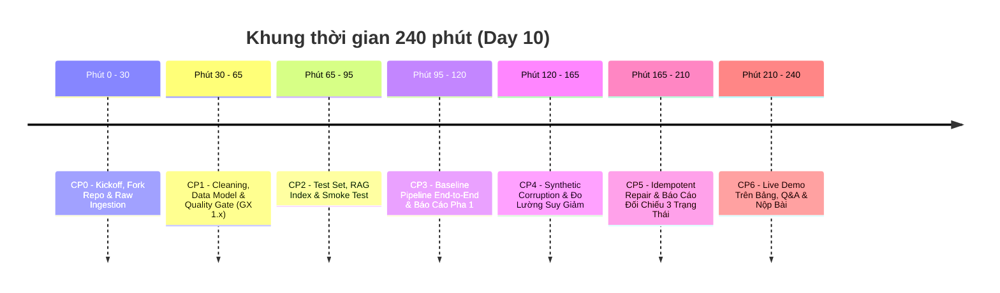

# Day 10 — Data Pipeline & Data Observability for RAG

> **Hình thức thực hiện:** Làm việc theo nhóm (Teamwork)  
> **Thời lượng:** 240 phút (4 giờ)  
> **Thời hạn nộp bài:** 23:59:59 ngày diễn ra bài lab (hoặc theo thông báo trên LMS)  
> 🔔 **Lưu ý vui nhưng cực kỳ quan trọng:** Dù nhóm làm chung một Repo GitHub, nhưng khi hết giờ, **từng cá nhân vẫn phải tự tay nộp đường link repo lên VLearn LMS** bằng tài khoản của mình nhé. Đừng để cả nhóm điểm 10 mà mình bị điểm 0 vì quên bấm nút submit!

---

### 🗺️ Bản Đồ Tài Liệu Cho Buổi Lab (Đọc gì trước, đọc gì sau?):
Đừng để nhiều file tài liệu làm bạn bị ngợp! Toàn bộ tài liệu chi tiết được quy hoạch gọn gàng trong thư mục [`docs/`](docs/):
- 🚀 **Bắt tay vào làm ngay:** Mở [Hướng Dẫn Kỹ Thuật Chi Tiết (docs/Guide.md)](docs/Guide.md) và bám sát tiến trình [Các Mốc Thời Gian (docs/CHECKPOINTS.md)](docs/CHECKPOINTS.md).
- 🎯 **Hiểu luật chơi & thang điểm:** Xem [Tiêu Chí Chấm Điểm (docs/RUBRIC.md)](docs/RUBRIC.md) và [Nội Quy Thực Hành (docs/RULES.md)](docs/RULES.md).
- 📋 **Phân công & nộp bài cuối giờ:** Điền thông tin vào [Phân Công Nhóm (docs/TEAM.md)](docs/TEAM.md) và đối chiếu checklist tại [Hướng Dẫn Nộp Bài (docs/SUBMISSION.md)](docs/SUBMISSION.md).

---

## 1. BÀI TOÁN & BẢN CHẤT NGHIỆP VỤ: "THỨC ĂN CỦA AGENT"

> 💡 *"Có một nhóm kỹ sư xây dựng hệ thống RAG rất ấn tượng. RAGAS scores cao chót vót, bản demo mượt mà. Hệ thống được đưa lên Production. Tuần đầu tiên vận hành êm đẹp. Sang tuần thứ ba — phòng Pháp lý cập nhật chính sách hoàn tiền mới. Nhưng không một ai nhớ cập nhật lại Vector Store!  
> Kết quả: Agent tiếp tục tư vấn chính sách cũ rích suốt 3 tuần, cho đến khi khách hàng làm ầm lên đòi kiện doanh nghiệp."*

### ⚠️ Hiểm họa Silent Failure: Khi AI giỏi đến đâu cũng trở nên vô nghĩa!
Trong kỹ thuật phần mềm truyền thống, nếu một hàm gặp lỗi, nó sẽ lập tức báo lỗi đỏ (`throw Exception`) và dừng chương trình. Chúng ta biết ngay chỗ sai để sửa. Nhưng với AI Agent & RAG, khi **Data Pipeline bị lỗi**:
- **Lấy thiếu dữ liệu (Ingestion fail):** Dữ liệu mới không vào kho $\rightarrow$ Agent trả lời bằng kiến thức lỗi thời (**Stale Data**).
- **Làm sạch sai (Cleaning fail):** Thiếu thông tin, câu chữ bị nhiễu $\rightarrow$ Bộ tìm kiếm lấy nhầm tài liệu.
- **Lưu trữ lỗi (Duplicate index):** Dữ liệu bị trùng lặp $\rightarrow$ Ngữ cảnh bị bóp méo, làm loãng câu trả lời của AI.

Đáng sợ nhất là: **Agent KHÔNG hề báo lỗi đỏ!** Nó vẫn trả lời một cách tự tin, trôi chảy — chỉ là **trả lời sai sự thật (Hallucination)**. Đó chính là **Silent Failure (Thất bại thầm lặng)** — căn bệnh nguy hiểm nhất của các hệ thống AI ứng dụng thực tế.

---

### 🎯 Sứ mệnh của bạn trong bài Lab này:
Thực tế sản phẩm AI: **60% – 80% thời gian của một dự án AI là xử lý dữ liệu, không phải tinh chỉnh model!** *"Garbage In -> Garbage Out"* (Dữ liệu rác vào thì kết quả rác ra). 

Bạn và nhóm sẽ đóng vai trò **Kỹ sư Dữ liệu & MLOps thực chiến**, xây dựng một Data Pipeline chuẩn chỉnh cho dữ liệu bài báo khoa học từ **Crossref Academic API**, tích hợp "chốt kiểm dịch dữ liệu" (**Data Quality Gate**) bằng **Great Expectations 1.x** để chặn đứng dữ liệu xấu trước khi nó kịp lọt vào Vector Store (ChromaDB).

Hệ thống phải vượt qua bài kiểm tra toàn diện:
1. **Luồng dữ liệu sạch (Baseline Flow):** Thu thập dữ liệu chuẩn, làm sạch, kiểm định chất lượng, nạp vào ChromaDB và đo lường độ chính xác ban đầu (Hit Rate, Token F1, LLM Judge).
2. **Thử thách tiêm lỗi (Controlled Corruption):** Chủ động "tiêm" 6 dạng lỗi dữ liệu thực tế (bỏ rơi bản ghi mới, xóa tóm tắt, chèn ký tự rác, cắt ngắn tiêu đề, làm cũ ngày tháng, nhân bản dòng).
3. **Cảnh báo chất lượng (Observability Alert):** Chứng minh Data Quality Gate và cơ chế giám sát độ tươi (Freshness Check) lập tức phát hiện và gióng chuông cảnh báo.
4. **Phục hồi an toàn (Idempotent Repair):** Tự động hồi phục dữ liệu từ bản sao lưu thô ban đầu (chạy lại bao nhiêu lần kết quả vẫn chuẩn sạch, không cần sửa tay), đối chiếu sự hồi phục trên cả 3 trạng thái: **Dữ liệu Sạch vs Dữ liệu Lỗi vs Sau Phục Hồi**.

---

## 2. BỨC TRANH TỔNG THỂ & CƠ CHẾ 2 CHẾ ĐỘ (DUAL-MODE)

### 2.1. Kiến trúc luồng dữ liệu 7 tầng:

```text
Nguồn Crossref API (hoặc Snapshot Offline data/raw/)
    ├── 1. Kéo dữ liệu & Lưu bản gốc (Raw Preservation) -> data/raw/crossref_records.json
    ├── 2. Làm sạch & Chuẩn hóa (Transformation)        -> data/clean/papers_clean.csv
    ├── 3. Trạm kiểm soát chất lượng (Quality Gate)     -> Great Expectations 1.x & Freshness
    ├── 4. Nhúng ngữ nghĩa & Lưu Vector (Index)         -> sentence-transformers + ChromaDB
    ├── 5. Đánh giá chất lượng RAG (Benchmark)          -> Hit Rate, Token F1, LLM Judge Score
    ├── 6. Thử thách tiêm độc tố dữ liệu (Corruption)   -> Giả lập 6 lỗi dữ liệu thực tế
    └── 7. Phục hồi an toàn & Đối chiếu (Repair)        -> Tái tạo từ Raw & Báo cáo 3 trạng thái
```

### 2.2. Cơ chế 2 chế độ (Dual-Mode Flexibility):
- 🟢 **Chế độ Dev / Offline (Khuyến nghị khi làm bài):** Pipeline tự động nạp từ file snapshot có sẵn tại `data/raw/crossref_response.json` (giúp bạn làm bài mượt mà ngay cả khi không có mạng hoặc khi API Crossref bị quá tải `429 Too Many Requests`).
- 🌐 **Chế độ Live API:** Khi cần dữ liệu mới nhất từ Internet, pipeline kết nối trực tiếp đến Crossref REST API.

---

## 3. KHUNG THỜI GIAN THỰC CHIẾN 240 PHÚT (4 TIẾNG)

Buổi thực hành được chia thành **7 Checkpoints chuẩn hóa (CP0 – CP6)** theo timeline 240 phút (tương thích tuyệt đối với Slide trình chiếu của Giảng viên):



| Checkpoint | Thời lượng | Trọng tâm công việc | Đầu ra bắt buộc (Pass Signal) |
| :--- | :--- | :--- | :--- |
| **CP0** | Phút 0 – 30 (30m) | Fork repo nhóm, cấu hình môi trường, nạp raw data | Console in `Môi trường sẵn sàng`, tồn tại `data/raw/` |
| **CP1** | Phút 30 – 65 (35m) | Chuẩn hóa schema, tính `age_days`, dựng Quality Gate GX 1.x | `data/clean/papers_clean.csv`, GX 1.x validation `True` |
| **CP2** | Phút 65 – 95 (30m) | Build MiniLM embedding, nạp ChromaDB, sinh `test_set.json` | `data/eval/test_set.json`, Chroma collection `papers-baseline` |
| **CP3** | Phút 95 – 120 (25m) | Chạy Baseline end-to-end, đo Hit Rate & Token F1 | `baseline_metrics.json`, `data/reports/phase1_report.md` |
| **CP4** | Phút 120 – 165 (45m) | Tiêm 6 lỗi dữ liệu, đo lường sự sụt giảm của RAG | `corruption_log.json`, `corrupted_metrics.json` |
| **CP5** | Phút 165 – 210 (45m) | Re-run repair từ raw data, xuất báo cáo đối chiếu 3 trạng thái | `corruption_report.md` (đủ 3 cột so sánh) |
| **CP6** | Phút 210 – 240 (30m) | Lên bảng Live Demo trước lớp, Q&A phản biện & nộp link LMS | Bảo vệ thành công, 100% thành viên commit & submit LMS |

---

## 4. CẤU TRÚC MÃ NGUỒN STARTER REPO

Starter Repo được cấu trúc dạng module hóa rõ ràng:

```text
.
├── data/
│   ├── raw/                 <- Chứa 2 file snapshot mẫu (crossref_response.json & records)
│   ├── clean/               <- Nơi xuất dữ liệu đã làm sạch
│   ├── chroma/              <- Database vector ChromaDB
│   ├── eval/                <- File test set benchmark
│   ├── quality/             <- Báo cáo Great Expectations và Freshness SLA
│   ├── reports/             <- Báo cáo Markdown (phase1_report.md, corruption_report.md)
│   └── results/             <- File JSON ghi nhận chỉ số (baseline, corrupted, repaired)
├── script/
│   ├── run_phase1.py        <- Entrypoint chạy toàn bộ Baseline Pipeline (CP3)
│   └── run_corruption_flow.py <- Entrypoint chạy Corruption, Repair & Comparison (CP4-CP5)
├── src/
│   ├── core/                <- Cấu hình đường dẫn Paths, settings và utils
│   ├── ingestion/           <- crossref.py (lấy data), cleaning.py (làm sạch), corruption.py (tiêm lỗi)
│   ├── retrieval/           <- MiniLM embedding, Chroma index, QA agent
│   ├── evaluation/          <- testset.py (sinh đề thi), metrics.py (tính Hit rate, F1)
│   ├── observability/       <- quality.py (Great Expectations 1.x), reporting.py
│   └── pipelines/           <- phase1.py (điều phối baseline), corruption_flow.py
├── docs/                    <- Thư mục tài liệu hướng dẫn, quy chuẩn và rubric của bài lab
│   ├── Guide.md             <- Hướng dẫn kỹ thuật chi tiết từng bước
│   ├── CHECKPOINTS.md       <- Tiến trình & nhiệm vụ từng mốc thời gian
│   ├── RUBRIC.md            <- Tiêu chí chấm điểm chi tiết (100đ chuẩn + 10đ bonus)
│   ├── RULES.md             <- Nội quy & liêm chính học thuật
│   ├── SUBMISSION.md        <- Hướng dẫn nộp bài & checklist kiểm tra
│   └── TEAM.md              <- Phân công nhóm & báo cáo cá nhân
├── .env.example             <- File mẫu cấu hình API key
├── README.md                <- Tài liệu tổng quan bài lab & bản đồ chỉ dẫn
└── pyproject.toml           <- Quản lý dependencies (Python 3.11-3.13)
```

> ⚠️ **LƯU Ý VỀ CODE KHUNG:**  
> Các file trong `src/` chứa các khối `TODO(student)` và `raise NotImplementedError`. Đây là bài tập thiết kế kỹ thuật, nhóm cần đọc kỹ docstring và hoàn thiện từng module theo thứ tự hướng dẫn trong [Guide.md](docs/Guide.md).

---

## 5. THIẾT LẬP MÔI TRƯỜNG & KHỞI ĐỘNG (CHECKPOINT 0)

### Bước 1: Khởi tạo Repo nhóm & Thêm Collaborators
1. **Trưởng nhóm:**
   - Fork repo gốc của lớp về tài khoản/tổ chức cá nhân: `https://github.com/VinUni-AI20k/K4-L3A-Day10-Data-Pipeline-Data-Observability`.
   - Đặt tên repo: `K4-L3-DAY10-TenNhom-DataPipeline`.
   - Vào **Settings > Collaborators > Add people** để mời tất cả thành viên trong nhóm.
2. **Các thành viên:**
   - Kiểm tra email, chấp nhận lời mời tham gia repo.
   - Clone repo của nhóm về máy tính cá nhân.

### Bước 2: Cài đặt Dependencies (Chọn 1 trong 2 cách)

#### Cách 1: Sử dụng `uv` (Khuyến nghị — cực nhanh và chuẩn lockfile)
```bash
uv sync
```

#### Cách 2: Sử dụng `venv` & `pip` truyền thống
Trên Windows PowerShell:
```powershell
python -m venv .venv
.\.venv\Scripts\Activate.ps1
python -m pip install --upgrade pip
python -m pip install -e .
```

Trên macOS / Linux:
```bash
python3 -m venv .venv
source .venv/bin/activate
python -m pip install --upgrade pip
python -m pip install -e .
```

> ⚠️ **Lưu ý sống còn:** Bắt buộc phải chạy `python -m pip install -e .` (chế độ editable package) để Python nhận diện thư mục `src/` như một package nội bộ, tránh gặp lỗi `ModuleNotFoundError: No module named 'core'`.

### Bước 3: Kiểm tra môi trường sẵn sàng:
```bash
python -c "import chromadb, great_expectations, sentence_transformers; print('Môi trường sẵn sàng')"
```
> **Tín hiệu hoàn thành:** Console in ra dòng chữ `Môi trường sẵn sàng`.

### Bước 4: Cấu hình biến môi trường (`.env`):
Tạo file `.env` từ `.env.example`:
```bash
# Windows PowerShell:
Copy-Item .env.example .env

# macOS / Linux:
cp .env.example .env
```
Mở file `.env` và điền API Key tương ứng (mặc định hỗ trợ `gemini`, `openai`, `anthropic`, `ollama`):
```dotenv
LLM_PROVIDER=openai
LLM_MODEL=gpt-4o-mini
OPENAI_API_KEY=
```

---

## 6. QUY TẮC PHỐI HỢP & CHECKLIST TRƯỚC KHI NỘP BÀI

### 👥 Phân chia vai trò gợi ý (Nhóm 4 thành viên):
- **Thành viên 1 (Pipeline Lead & Integrator):** Điều phối luồng, quản lý cấu hình `core/`, kết nối `phase1.py` và `corruption_flow.py`.
- **Thành viên 2 (Data Foundation Owner):** Phụ trách thu thập `crossref.py`, làm sạch `cleaning.py` và khôi phục dữ liệu từ Raw.
- **Thành viên 3 (RAG & Agent Specialist):** Quản lý Embedding MiniLM, ChromaDB vector store, logic truy vấn và QA Agent trong `retrieval/`.
- **Thành viên 4 (Observability & Evaluation Lead):** Triển khai Great Expectations 1.x trong `quality.py`, Freshness SLA, bộ `testset.py` và sinh báo cáo Markdown đối chiếu.

---

### 📋 Checklist Nghiệm thu & Điều kiện nộp bài (Checkpoint 6):

- [x] **Môi trường:** Chạy lệnh smoke test in ra `Môi trường sẵn sàng`.
- [x] **Pha 1 (Baseline):** Lệnh `python script/run_phase1.py` chạy trơn tru, sinh đầy đủ:
  - `data/clean/papers_clean.csv`
  - `data/eval/test_set.json`
  - `data/results/baseline_metrics.json`
  - `data/reports/phase1_report.md`
- [x] **Pha 2 (Corruption & Repair):** Lệnh `python script/run_corruption_flow.py` chạy thành công, tạo ra:
  - `data/results/corruption_log.json` (ghi nhận 6 dạng lỗi)
  - `data/results/corrupted_metrics.json` (chứng minh chỉ số giảm sút)
  - `data/results/repaired_metrics.json` (chứng minh chỉ số phục hồi)
  - `data/reports/corruption_report.md` (bảng đối chiếu 3 trạng thái rõ ràng)
- [x] **Data Observability (GX 1.x):** Quality Gate sử dụng cú pháp chuẩn GX 1.x (`gx.get_context()`, `add_pandas()`), phát hiện thành công khi data bị inject lỗi.
- [x] **Bảo mật:** Không commit file `.env` hoặc API Key cá nhân lên GitHub.
- [ ] **Kiểm tra Contributor trên GitHub:** 
  > ⚠️ **QUY TẮC ĐIỂM DANH GITHUB:**  
  > GitHub chỉ ghi nhận đóng góp khi commit được push trực tiếp vào **nhánh mặc định (`main`)**.  
  > Trước khi nộp bài, mở trình duyệt vào repo nhóm, chọn tab **Insights > Contributors**. Bắt buộc mọi thành viên trong nhóm đều phải xuất hiện trên biểu đồ commit thì mới được tính điểm chuyên cần nhóm!
- [ ] **Nộp bài lên VLearn LMS:** Mỗi thành viên copy đường link repository GitHub của nhóm và nộp lên cổng LMS trước khi đồng hồ đếm ngược kết thúc 240 phút!
